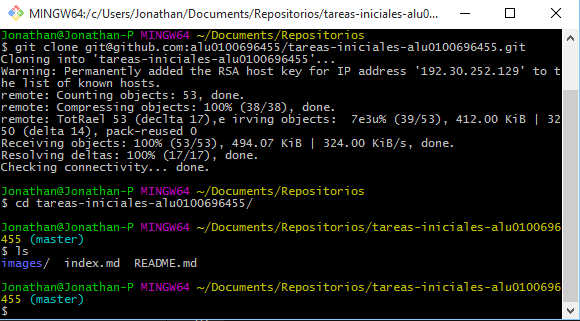
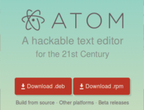
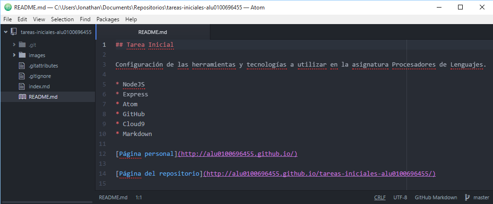
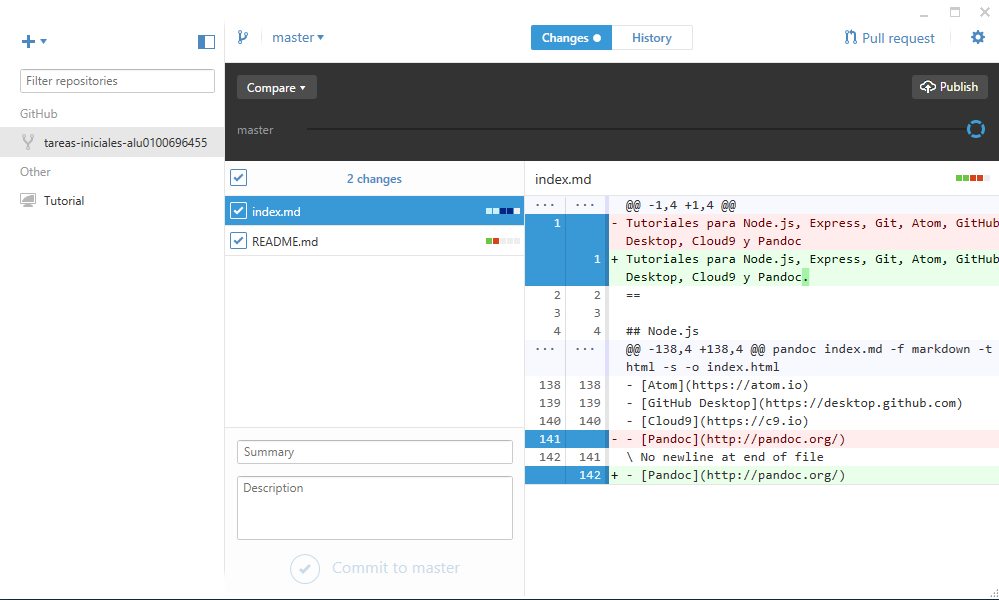
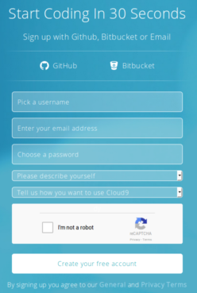

Tutoriales para Node.js, Express, Git, Atom, GitHub Desktop, Cloud9 y Pandoc
==

## Node.js
Node.js® is a platform built on Chrome's JavaScript runtime for easily building fast, scalable network applications. Node.js uses an event-driven, non-blocking I/O model that makes it lightweight and efficient, perfect for data-intensive real-time applications that run across distributed devices.

### Ubuntu

**1. Instalación**

Para la instalación en *Ubuntu* introduciremos las siguientes líneas en la terminal:

```
curl -sL https://deb.nodesource.com/setup | sudo bash -

sudo apt-get install -y nodejs
```

**2. Uso**

Para empezar a usar *Node.js* escribiremos el siguiente comando en la terminal:

```
nodejs
```

### Windows

**1. Instalación**

Para la instalación en *Windows* nos descargaremos el instalador directamente de la página [nodejs.org](http://nodejs.org).

**2. Uso**

Para empezar a usar *Node.js* abriremos la aplicación instalada con el mismo nombre, abriéndose así la consola.

### Primeros pasos

Para probar que todo ha ido bien probaremos lo siguiente:

```
console.log("Hola Mundo");
console.log(2+3);
```

La salida de estas líneas debería coincidir con la imagen adjunta.


## Express

Express es una infraestructura de aplicaciones web Node.js mínima y flexible que proporciona un conjunto sólido de características para las aplicaciones web y móviles.

**Instalación**

Para la instalación, tanto en Windows como en Ubuntu, introduciremos la siguiente línea en la terminal:

```
npm install express --save
```

## Git

Git is a free and open source distributed version control system designed to handle everything from small to very large projects with speed and efficiency.

**Instalación**

Para la instalación en Ubuntu introduciremos las siguientes líneas en la terminal:

```
apt-get install git
```

Una vez hecho esto ya podremos empezar a usar el comando git.

En Windows visitaremos la página https://git-scm.com/ para descargarnos el instalador. Una vez instalado dispondremos de las terminales Git Bash y Git CMD para utilizar git.



## Atom

Atom is a text editor that's modern, approachable, yet hackable to the core—a tool you can customize to do anything but also use productively without ever touching a config file.

**Instalación**

Para instalar *Atom* debemos visitar la página https://atom.io/ y descargar el instalador.



En Ubuntu, una vez descargado lo instalaremos con la siguiente línea en la terminal:
```
sudo dpkg -i atom-amd64.deb
```

En Windows iniciaremos el ejecutable descargado para iniciar la instalación de la aplicación.



## GitHub Desktop

GitHub Desktop es un entorno gráfico para trabajar con repositorios git. Está disponible para Windows y Mac.

**Instalación**

Para instalar *GitHub Desktop* debemos visitar la página https://desktop.github.com/ y descargar el instalador en caso de Windows o el fichero comprimido en caso de Mac.


En Windows nos descargaremos un ejecutable que nos permite instalar la aplicación, mientras que en Mac nos descargaremos un fichero comprimido con el programa.



## Cloud9

Cloud9 es un entorno de desarrollo en la nube. Contiene un editor de texto y un espacio de trabajo en Ubuntu alojado en la nube.


Para empezar a utilizarlo debemos registrarnos en la página https://c9.io.



Nos permite registrarnos desde cero o utilizando una cuenta de GitHub o Bitbucket.

## Pandoc

**Instalación**

En Ubuntu, nos descargaremos el fichero .deb de la última versión de Pandoc desde https://github.com/jgm/pandoc/releases/, una vez descargado lo instalaremos con la siguiente línea en la terminal:

```
dpkg -i pandoc-1.16.0.2-1-amd64.deb
```

Para instalarlo en Windows, nos descargaremos el fichero .msi de la última versión de Pandoc desde https://github.com/jgm/pandoc/releases/, este ejecutable instalará lo necesario para poder usar la herramienta.

**Uso**

Con el comando `pandoc` en la línea de comandos podemos empezar a utilizarlo. Por ejemplo, si queremos pasar este fichero Markdown a HTML introduciremos la siguiente línea:

```
pandoc index.md -f markdown -t html -s -o index.html
```

## Recursos:

- [NodeJS](https://nodejs.org)
- [Express](http://expressjs.com/es/)
- [Git](https://git-scm.com/)
- [Atom](https://atom.io)
- [GitHub Desktop](https://desktop.github.com)
- [Cloud9](https://c9.io)
- [Pandoc](http://pandoc.org/)